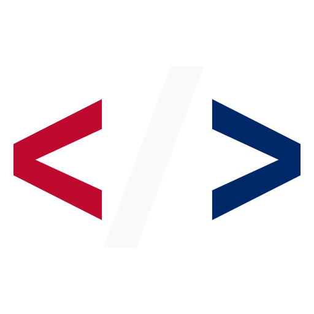

---
hide:
  - navigation
comments: true
---

# About Uniformed.dev
## What is Uniformed.dev?
{: align="right" style="width: 150px" }

Uniformed.dev was created by William Crum, a nerd at heart. This site is meant for individuals who are asking themselves: *how can I make a solution for my branch, my community to help the mission?*

Traversing technology in the Department of Defense (DoD) can be tricky, collaboration and communication is the key for a healthy innovative ecosystem for the developer, security manager, product manager, welp. Pretty much anyone and everyone.

At the end of the day, you are at this site, you are contributing to the DoD in some fashion and want to do more for your community. So lets find you a community, a group of nerds, a group of veterans.

## Contribute to Uniformed.dev

This project was created for the sole purpose of getting more uniformed members to start coding. I am linking these organizations with no affiliation to them or to the greater Department of Defense. 