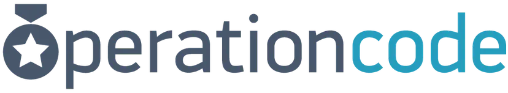

---
hide:
  - toc
  - navigation
---

<h1 align="center" class="typerheader">
 We are groups of
  <a href="#" class="typewrite" data-period="2000" data-type='[ "Developers.", "Marines.", "Sailors.", "Engineers.", "Airmen.", "Guardians.", "Veterans."]'>
    
  </a>
</h1>

-   __Airmen Coders__

    ---

    {: align="left" style="width:150px;"}
    We are a group of U.S. Air Force Airmen who use code to improve the lives of our fellow Airmen. Airmen Coders is proudly `#PoweredByTron`

    [:octicons-arrow-right-24: Airmen Coders](https://airmencoders.us/)

-   __Supra Coders__

    ---
    {: align="left" style="width:150px;"}
    U.S. Space Force coders creating innovative, cutting-edge software to enhance warfighter capabilities in an ever-evolving digital domain.

    [:octicons-arrow-right-24: Supra Coders](https://supracoders.us/)

-   __Marine Coders__

    ---
    {: align="left" style="width:150px;"}
    Marine Coders is a non-official organization comprised of Active Duty/Reserve Marines, Marine Veterans, and U.S. Citizens who want to help Marines through code.

    [:octicons-arrow-right-24: Marine Coders](https://marines.dev)

-   __Army Coders__

    ---
    {: align="left" style="width:150px;"}
    Continuously recylcing the effort and expanding as we go. Building a grassroots effort to connect Soldier Coders to coding and training resources.

    [:octicons-arrow-right-24: Army Coders](https://coders.army/)

## Other Organizations

-   __Operation Code__

    ---

    {: align="left" width="150px"}
    We're the largest community of military veterans, service members, and spouses committed to becoming software developers with the help of mentors, scholarships, and our tech partners.

    [:octicons-arrow-right-24: Operation Code](https://operationcode.org/)

-   __The Joint Software Alliance__

    ---
    {: align="left" width="150px"}
    U.S. Space Force coders creating innovative, cutting-edge software to enhance warfighter capabilities in an ever-evolving digital domain.

    [:octicons-arrow-right-24: Joint Software Alliance](https://supracoders.us/)

