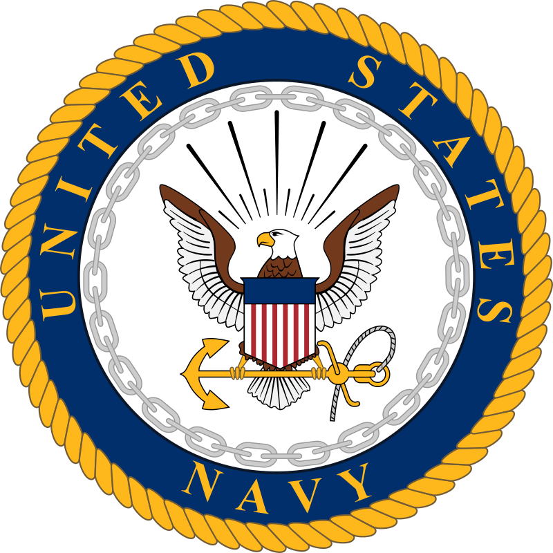
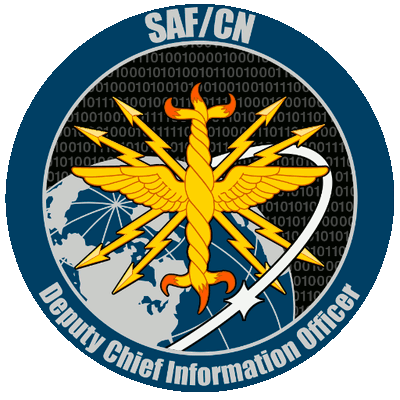

---
hide:
  - navigation
  - toc
--- 
# Software Factories by Branch

-   [__U.S. Airforce__](/swf/usaf)

    [{: style="width: 150px"}](/swf/usaf)

-   [__U.S. Space Force__](/swf/usaf/#us-space-force)

    [{: style="width: 150px"}](/swf/usaf/#us-space-force)

-   [__U.S. Army__](/swf/army)

    [{: style="width: 150px"}](/swf/army)

-   [__U.S. Navy__](/swf/usn)

    [{: style="width: 150px"}](/swf/usn)

-   [__U.S. Marine Corps__](/swf/usmc)

    [{: style="width: 150px"}](/swf/usmc)

# Software Factory Coalition

!!! quote "Mission Statement"

    {: style="width: 150px;float: inline-end; margin: 2.5%"} The mission of the Software Factory Ecosystem Coalition is to bring the DoD Software Factory Ecosystem together to improve innovation by sharing discoveries, swarm to solve problems, and self-govern software factory functions to enable reuse, reduce unnecessary duplication, and allow for necessary specialization.Learn more about us. [^1]

    [:octicons-arrow-right-24: Learn More about Software Factory Coalition](https://coalition.dso.mil/)

### Organizations Apart of Software Factory Coalition

-   __Overmatch Software Armory__

    {: style="width: 150px"}

-   __SAF Chief Information Officers__

    {: style="width: 150px"}

-   __Space Camp__

    {: style="width: 150px"}

-   __Corsair Ranch__
    
    {: align="center" style="width: 150px"}

-   __Bespin__
    
    {: align="center" style="width: 150px"}

-   __Army Software Factory__
    
    {: style="width: 150px"}

-   __Platform One__
    
    {: style="width: 150px"}

-   __Level Up__
    
    {: style="width: 150px"}

-   __Kobayashi Maru__
    
    {: style="width: 150px"}

-   __Joint Special Operations Command__
    
    {: style="width: 150px"}

-   __Chief Digital and Artificial Intelligence Office__

    {: style="width: 150px"}

-   __Kessel Run__

    {: style="width: 150px"}

[^1]: [Software Factory Coalition - coalition.dso.mil](https://coalition.dso.mil/)

