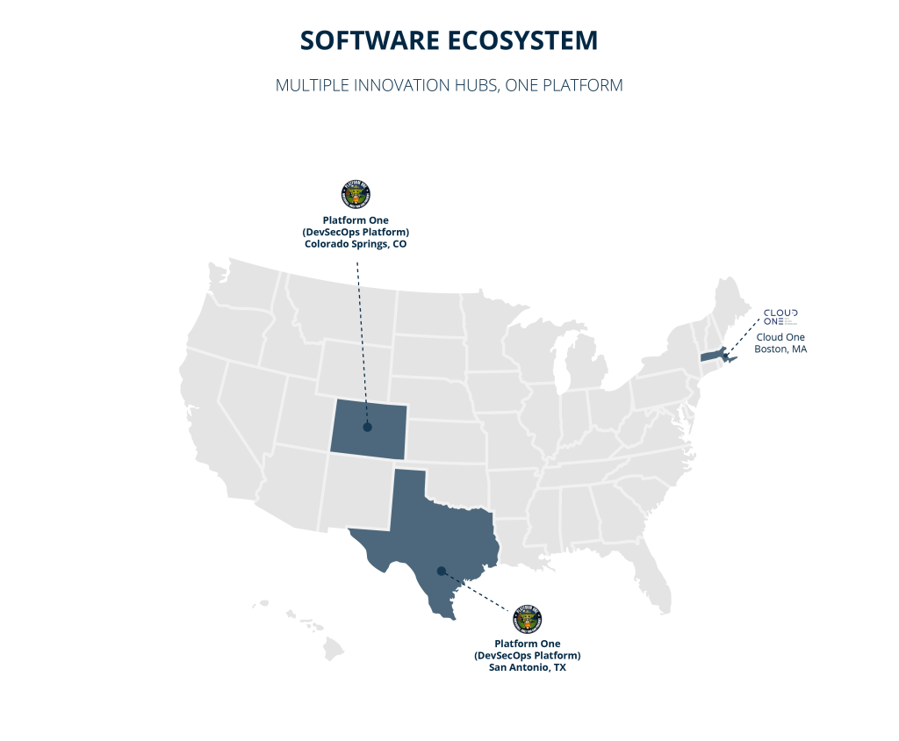
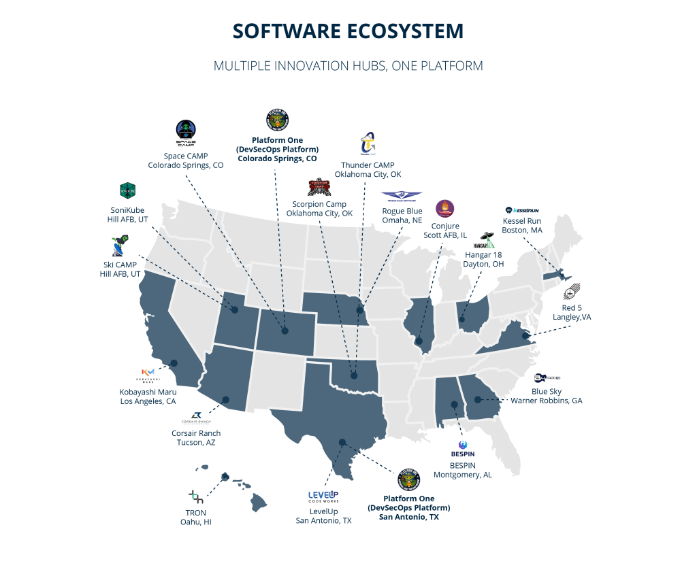
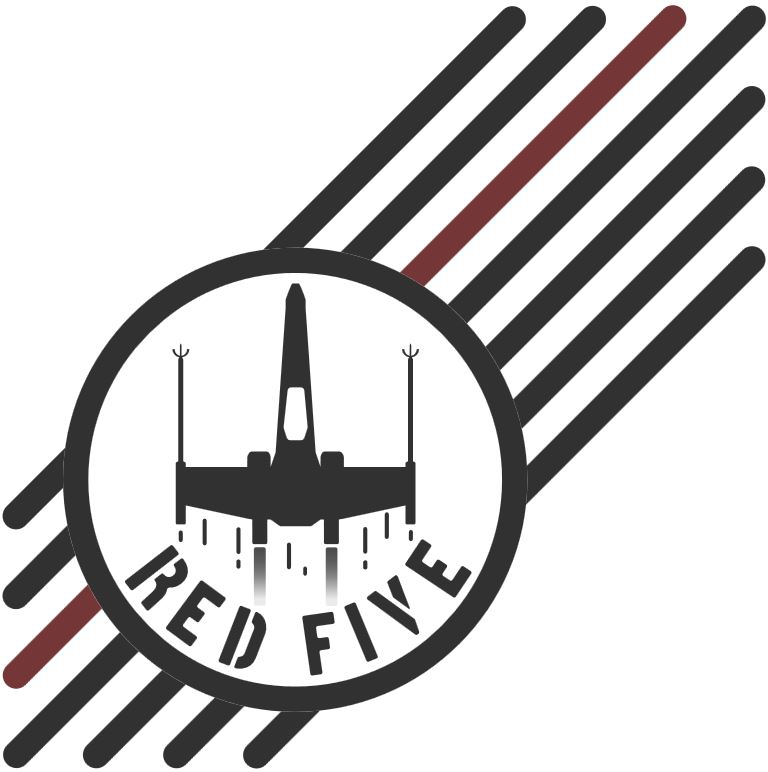
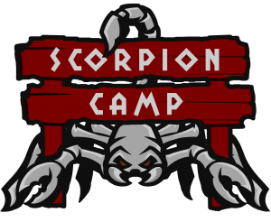
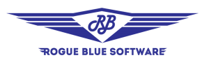
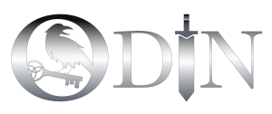

---
hide:
  - navigation
---

!!! note "Page Notice"
    All images, content have been taken from [software.af.mil](https://software.af.mil/). The purpose of this site is to congregate information from across the Departmen of Defense and put it in a central location.

# U.S. Airforce and Space Force Software Factories

=== "Software Ecosystem"
    

=== "Enterprise Services"
    

=== "SWEGS"
    

=== "Software Factories"
    

## U.S. Airforce

<!--

    [:material-web:](/test) :octicons-mail-16: :material-message-fast:

-->

!!! quote ""
    {: style="float: left; width: 200px; margin: 2.5%"}
    ### LevelUp
    LevelUP is the cyber factory team for the Air Force and is the team behind Platform One. It is the centralized team that provides DevSecOps/Software Factory managed services with baked-in security to Air Force and Department of Defense programs. The team will provide the ability to deploy a DevSecOps Platform (CNCF-compliant Kubernetes stack) and Continuous Integration/Continuous Delivery (CI/CD) pipeline with a Continuous Authority to Operate (c-ATO).

!!! quote ""
    {: style="float: left; width: 150px; margin: 2.5%"}
    ### Business and Enterprise System Product Innovation (BESPIN)

    “Deliver exceptional custom mobile experiences for all Airmen that improve quality of life, mission success, and safety.” – Restless Creations – Execution, Cultural Change, Change Management, and User research and design focused support.

!!! quote ""
    {: style="float: left; width: 150px; margin: 2.5%"}
    ### Kessel Run
    Deliver combat capability that can sense and respond to conflict in any domain, any time, anywhere.

!!! quote ""
    {: style="float: left; width: 150px; margin: 2.5%"}
    ### Kobayashi Maru
    The Space Command and Control (C2) program (Kobayashi Maru) provides capabilities that bring critical services to our warfighters to facilitate timely, quality battlespace decisions.

!!! quote ""
    {: style="float: left; width: 150px; margin: 2.5%"}
    ### SkiCAMP
    We are a Platform1 software factory located in Salt Lake City, Utah, focused on the continuous development and deployment of Hill AFB mission applications to the warfighter.

!!! warning "Replace Sonikube logo with something that is backgruond transparent."

!!! quote ""
    {: style="float: left; width: 150px; margin: 2.5%"}
    ### Sonikube
    SoniKube is a node of LevelUp located within the AFSC SWEG Enterprise (Air Force Sustainment Center / Software Engineering Groups). This isn’t the waterfall software factory the United States defense industry standardized in the 80’s. 

!!! quote ""
    {: style="float: left; width: 150px; margin: 2.5%"}
    ### TRON
    The Tron team is a group of Airmen from differing jobs and career fields working in collaboration with contractors who have knowledge in the industry best practices for software development, design, and management. The team utilizes agile methodologies, scrum techniques, test driven development, and human-centered design to ensure that the products being built will benefit the end user by reducing the manual processes and task saturation that many Airmen face in their day to day jobs.

!!! quote ""
    {: style="float: left; width: 150px; margin: 2.5%"}
    ### 309th Software Engineering Group
    CODE WITH HONOR. The 309th Software Engineering group at Hill AFB is recognized as a world leader in “cradle-to-grave” support systems. They encompass hardware engineering, software engineering, cybersecurity, cloud security, program management, consulting, data management, and much more.

!!! quote ""
    {: style="float: left; width: 150px; margin: 2.5%"}
    ### CONJURE
    Air Mobility Command’s premier agile software factory, delivering user-centered software supporting Mobility Air Force warfighters to provide rapid global mobility to the Department of Defense. Conjure partnered with Kessel Run for AMC’s Magellan application, and has built a partnership with Platform One to develop and host future AMC applications. Our logo is linked to the 375th Communications Support Squadron’s Wizard mascot and AMC’s heritage of the Phoenix.

!!! warning "Replace Sonikube logo with something that is backgruond transparent."

!!! quote ""
    {: style="float: left; width: 150px; margin: 2.5%"}
    ### RED 5
    Red 5 is co-located with DGS-1 at Joint Base Langley-Eustis, VA and supported by the 10 IS, 497th ISRG, 480th ISRW. Our mission is to create a new culture within the Air Force that will allow our Airmen to enhance their problem-solving abilities through education and experience in software development. By listening to our fellow Airmen within, we identify problems and create expedient software solutions that, through their delivery, augment our Airmen’s abilities with the power of tech, to ensure our warfighters remain unrivaled within an ever-evolving battle space.

!!! quote ""
    {: style="float: left; width: 150px; margin: 2.5%"}
    ### Corsair
    Corsair Ranch, the ANG AFRC Test Center Software Division (AATC/DXW), exists to deliver Air Reserve Component (ARC) Capability Faster in line with the AATC mission. Corsair Ranch works across multiple weapon systems and directly with flight test stakeholders to engage users, continuously and incrementally deliver software capability, and field capability in support of combat, domestic, and acquisition outcomes. Corsair Ranch leverages Citizen Airman talent, Platform One, and relationships with like-minded teams – including Kessel Run, EDDGE, and TRON – to scale Total Force digital transformation.

!!! quote ""
    {: style="float: left; width: 150px; margin: 2.5%"}
    ### Scorpion Camp
    Providing Air Force Mission Defense Teams with tailored software capabilities in order to detect, defend, and deter cyber threats across high-value weapons systems.

!!! quote ""
    {: style="float: left; width: 150px; margin: 2.5%"}
    ### HANGAR 18
    Hangar 18 delivers software and data capabilities to the Digital Engineering and Acquisition community, as well as others seeking innovative and agile solutions. Founded by the Air Force Research Laboratory and the Air Force Institute of Technology, we leverage a federation of digital teams and assets to engage in solutions engineering, DevSecOps, workforce development, education, training and community engagement.

!!! quote ""
    {: style="float: left; width: 150px; margin: 2.5%"}
    ### Rogue Blue
    Rogue Blue Software provides an expert software development, integration, and deployment platform across all enclave classifications up to the highest levels principally for Nuclear Command and Control (NC2), the Nation’s critical nuclear enterprise.

!!! quote ""
    {: style="float: left; width: 150px; margin: 2.5%"}
    ### ODIN
    ODIN offers a Platform as a Service (PaaS) and Partybus Software Factory option. Both options provide Customers with develop, test and production environments on all three enclaves. Centrally funded, in part, by Headquarters Air Force, ODIN’s partnership with Platform One allows us to provide customers an accredited Partybus pipeline and continuous Authority to Operate (cATO).

## U.S. Space Force

!!! quote ""
    {: style="float: left; width: 150px; margin: 2.5%"}
    ### Space CAMP
    Located in Colorado Springs, CO, [Space CAMP](https://spacecamp.il2.dso.mil/#/home) is a software factory focused on the continuous development and deployment of USSF mission applications to the warfighter. As a software node of Platform One (the DoD Executive agent for DevSecOps) for Continuous Integration/Continuous Deployment (CI/CD), we aim to avoid vendor-lock by building an open platform (Kubernetes/Istio), embracing DevSecOps principles outlined by the DoD CIO and AF CSO, considering microservice/service mesh architectures early and often, leveraging event-driven behavior across the entire portfolio, and building a network of like-minded software shops for collaboration.

